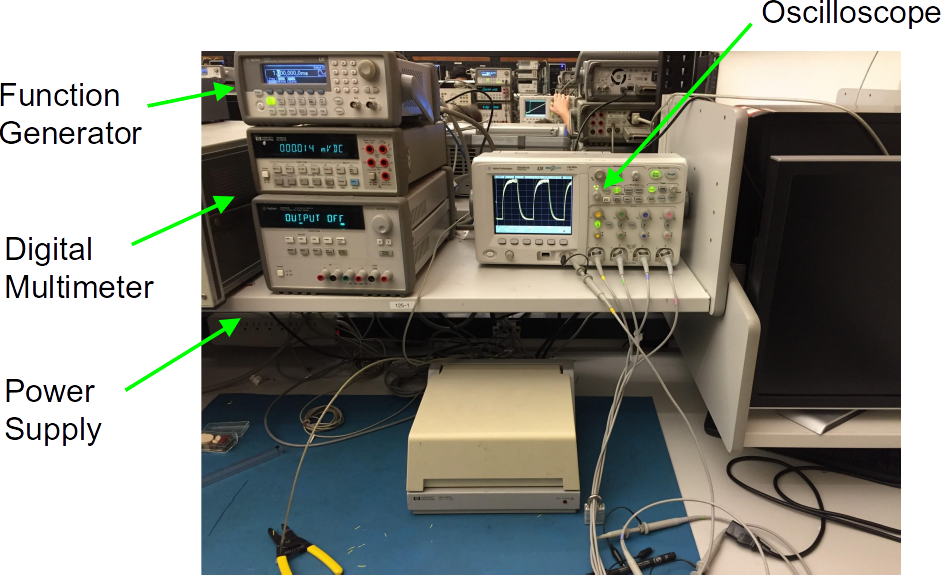
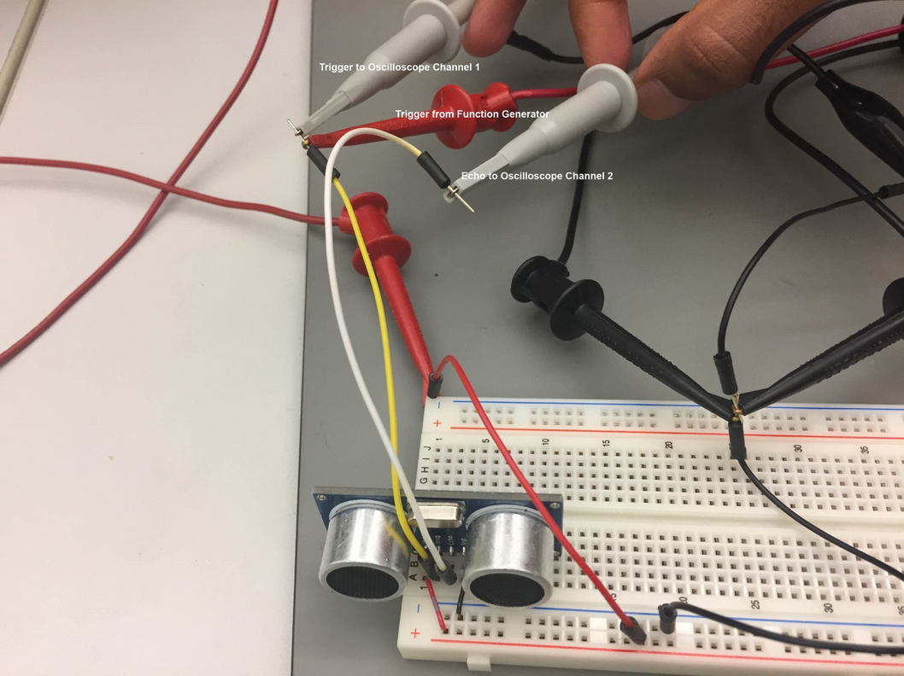
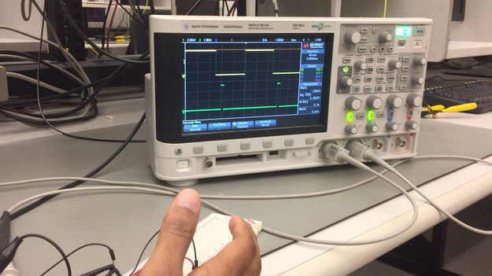

# Angklung

This week we are going to practice the process to upload code to a board, establish a serial communication with a computer, and use a computer to analyze the data from serial port. In addition, we will have the first chance to use oscilloscope, function generator, and power supply to test and understand HC-SR4 sensors.

At the end of the class, we will play all together a [song](http://bit.ly/2fzAcMh).

This week experience is composed of 4 steps: laboratory equipment, HC-SR4 sensor characterization, HC-SR4 sensor implementation in a development board, and system integration.

## 1. Laboratory Equipment

This week we will start using oscilloscope, function generator, and power supply. They are extremely helpful on hardware design and debugging, so try to practice with them as much as possible. The following picture shows a typical setup that you will find in an electronics lab.

### DC Power Supply

A DC power supply supplies DC (constant) voltage, or in other words, it supply electric energy to an electrical load. You can use them to feed and test your sensors and circuits. Today we will use them to generate a 5V supply needed for the HC-SR4 sensor. In order to setup a power supply you need to follow these instructions (see [video](https://youtu.be/oP0IX2d84Nk)):

1. Power supply is turned on
2. Current limit is set appropriately (0.1A)
3. Set your voltages
4. Output is on
5. Positive terminal connected to the appropriate breadboard power rails
6. Negative terminal connected to all breadboard ground rails

Note that you can buy a new DC power supply for ~$30.

### Function Generator

A function generator is an equipment used to generate different types of electrical waveforms over a wide range of frequencies. We will use them to simulate a trigger signal for the HC-SR4 sensor. To setup a signal follow these instructions (see [video](https://youtu.be/zpEMqZeFxMI)):

1. Positive terminal connected to designated input
2. Negative terminal connected to all breadboard ground rails
3. Port impedance is set to High-Z
4. Output is on
5. Set output waveform is as desired

### Oscilloscope

Oscilloscope are use to observe and measure constantly varying signal voltages as a function of time. To set up your oscilloscope follow these instructions (for setup see this [video](https://youtu.be/ZjLhh1Y8Asw), and for signal measurement follow this [video](https://youtu.be/t1-gUZGON_E)):

1. Probe ground clips are connected to a breadboard ground rail
2. Voltage and time scales are appropriate and reasonable
3. The green “Run” button is lit up
4. Trigger level is appropriately set
Channel probe type is set to 10X

### Breadboard

Breadboard are for prototyping of electronics. They let you construct a circuit without soldering its component. Follow the picture for connection configuration:

## 2. HC-SR4 Sensor Characterization

Before we use the ultrasonic sensor in our final circuit, it’s worthwhile to simply test the sensor to ensure it operates as expected. You can always find details about pin locations/usage and specifications like operating voltages, current limits, and outputs by searching online for a datasheet. For the HC-SR04, there are 4 pins (Vdd, Trig, Echo, Gnd) which should be connected similar to what’s shown in the following image. Vdd(Power) and Ground should be wired to the 5 volts from the Power Supply.

The trigger pin should be connected to a function generator which will supply a square wave. Both the trigger and echo pins should be connected to the oscilloscope so that we can observe them later.

Finally, it is generally good practice to make sure your grounds are all referencing the same voltage. Multiple grounds in a circuit can sometimes lead to unexpected behavior if not wired properly. Here, the power supply and function generator are crucially using the same ground and additionally the oscilloscope channels are as well.

Once the sensor is on the breadboard, turn on the power supply output, function generator output, and the oscilloscope. As this [video](https://youtu.be/UqZWHig9Gnw) shows, click the autoscale button. You should see at least the square wave and some signal for the echo. If the echo signal does not display completely on the screen, scale and translate the signal until all of it does. Now both signals should be visible and you can manipulate the duty cycle of the echo signal by moving your hand closer or further to the sensor as shown in this [video](https://youtu.be/BAyzCAeqiWk).

## 3. HC-SR4 Sensor Implementation in a Development Board

picture redbear duo pins / particle photon

picture sensor set up

## 4. System Integration
